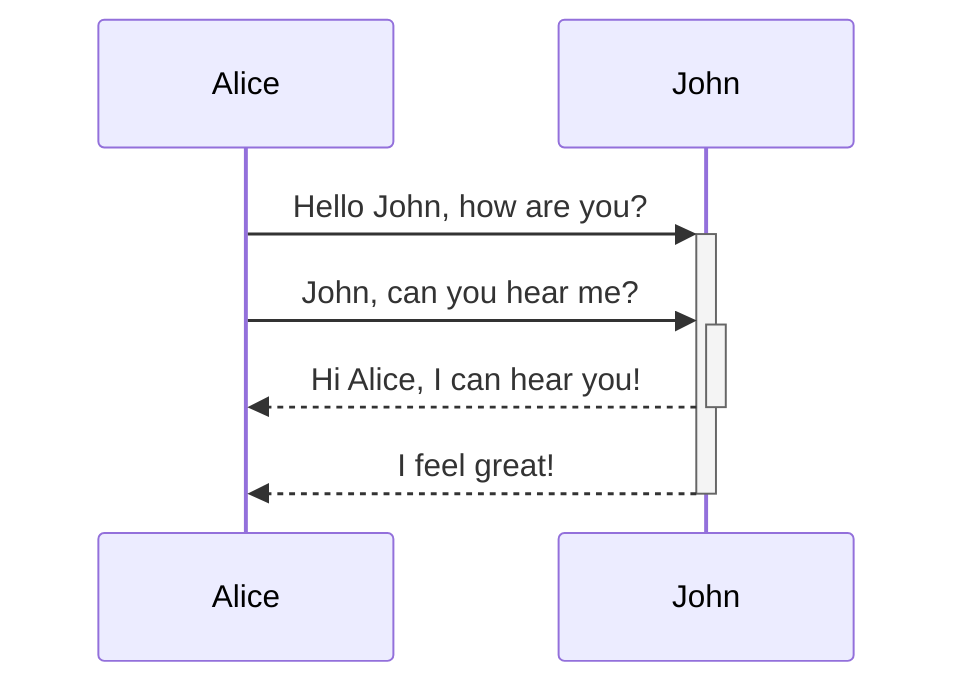
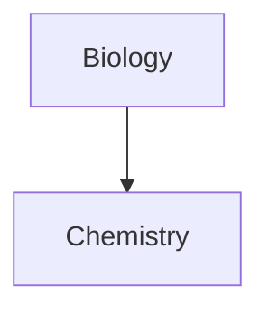

Markdown is a plain-text file format designed to be human readable and yet provide powerful styling information. 

## Flavors
It is important to remember that Markdown is a non-standard file format. As such, every markdown editor and renderer interprets Markdown slightly differently, and certain features may not be available everywhere. For this reason, the community talks about different *flavors* of Markdown. Here are some of the popular ones: 

- Vanilla Markdown
- CommonMark
- GitHub Flavored Markdown
- 
- LaTeX
## Features

Here are many of the popular features available in various forms of Markdown. Again, it is important to remember that some of these features may be more widely available than others. 


> [!NOTE] Sources
> The majority of the content on this page was taken from the [[Obsidian]] [help site](https://help.obsidian.md/Editing+and+formatting/Basic+formatting+syntax). Please support them, and buy their fantastic software! :D  

### Paragraphs

To create paragraphs, use a blank line to separate one or more lines of text.

```
This is a paragraph.

This is another paragraph.
```

Multiple blank spaces

### Headings

To create a heading, add up to six `#` symbols before your heading text. The number of `#` symbols determines the size of the heading.

```md
# This is a heading 1
## This is a heading 2
### This is a heading 3
#### This is a heading 4
##### This is a heading 5
###### This is a heading 6
```
### Bold, italics, highlights

Text formatting can also be applied using [Editing shortcuts](https://help.obsidian.md/Editing+and+formatting/Editing+shortcuts).

|Style|Syntax|Example|Output|
|---|---|---|---|
|Bold|`** **` or `__ __`|`**Bold text**`|**Bold text**|
|Italic|`* *` or `_ _`|`*Italic text*`|_Italic text_|
|Strikethrough|`~~ ~~`|`~~Striked out text~~`|~~Striked out text~~|
|Highlight|`== ==`|`==Highlighted text==`|==Highlighted text==|
|Bold and nested italic|`** **` and `_ _`|`**Bold text and _nested italic_ text**`|**Bold text and _nested italic_ text**|
|Bold and italic|`*** ***` or `___ ___`|`***Bold and italic text***`|**_Bold and italic text_**|

Formatting can be forced to display in plain text by adding a backslash `\` in front of it.

**This line will not be bold**

```markdown
\*\*This line will not be bold\*\*
```

*_This line will be italic and show the asterisks_*

```markdown
\**This line will be italic and show the asterisks*\*
```

### Internal links

Obsidian supports two formats for [internal links](https://help.obsidian.md/Linking+notes+and+files/Internal+links) between notes:

- Wikilink: `[[Three laws of motion]]`
- Markdown: `[Three laws of motion](Three%20laws%20of%20motion.md)`

### External links

If you want to link to an external URL, you can create an inline link by surrounding the link text in brackets (`[ ]`), and then the URL in parentheses (`( )`).

```md
[Obsidian Help](https://help.obsidian.md)
```

[Obsidian Help](https://help.obsidian.md/)

You can also create external links to files in other vaults, by linking to an [Obsidian URI](https://help.obsidian.md/Extending+Obsidian/Obsidian+URI).

```md
[Note](obsidian://open?vault=MainVault&file=Note.md)
```

#### Escape blank spaces in links

If your URL contains blank spaces, you must escape them by replacing them with `%20`.

```md
[My Note](obsidian://open?vault=MainVault&file=My%20Note.md)
```

You can also escape the URL by wrapping it with angled brackets (`< >`).

```md
[My Note](<obsidian://open?vault=MainVault&file=My Note.md>)
```

### External images

You can add images with external URLs, by adding a `!` symbol before an [external link](https://help.obsidian.md/Editing+and+formatting/Basic+formatting+syntax#External%20links).

```md

```


You can change the image dimensions, by adding `|640x480` to the link destination, where 640 is the width and 480 is the height.

```md

```

If you only specify the width, the image scales according to its original aspect ratio. For example:

```md

```

Tip

If you want to add an image from inside your vault, you can also [embed an image in a note](https://help.obsidian.md/Linking+notes+and+files/Embed+files#Embed%20an%20image%20in%20a%20note).

### Quotes

You can quote text by adding a `>` symbols before the text.

```md
> Human beings face ever more complex and urgent problems, and their effectiveness in dealing with these problems is a matter that is critical to the stability and continued progress of society.

\- Doug Engelbart, 1961
```

> Human beings face ever more complex and urgent problems, and their effectiveness in dealing with these problems is a matter that is critical to the stability and continued progress of society.

- Doug Engelbart, 1961

Tip

You can turn your quote into a [callout](https://help.obsidian.md/Editing+and+formatting/Callouts) by adding `[!info]` as the first line in a quote.

### Lists

You can create an unordered list by adding a `-`, `*`, or `+` before the text.

```md
- First list item
- Second list item
- Third list item
```

- First list item
- Second list item
- Third list item

To create an ordered list, start each line with a number followed by a `.` symbol.

```md
1. First list item
2. Second list item
3. Third list item
```

1. First list item
2. Second list item
3. Third list item

#### Task lists

To create a task list, start each list item with a hyphen and space followed by `[ ]`.

```md
- [x] This is a completed task.
- [ ] This is an incomplete task.
```

- [x] This is a completed task.
- [ ] This is an incomplete task.

You can toggle a task in Reading view by selecting the checkbox.

Tip

You can use any character inside the brackets to mark it as complete.

```md
- [x] Milk
- [?] Eggs
- [-] Eggs
```

- [x] Milk
- [x] Eggs
- [x] Eggs

#### Nesting lists

All list types can be nested in Obsidian.

To create a nested list, indent one or more list items:

```md
1. First list item
   1. Ordered nested list item
2. Second list item
   - Unordered nested list item
```

1. First list item
    1. Ordered nested list item
2. Second list item
    - Unordered nested list item

Similarly, you can create a nested task list by indenting one or more list items:

```md
- [ ] Task item 1
	- [ ] Subtask 1
- [ ] Task item 2
	- [ ] Subtask 1
```

- [ ] Task item 1
    - [ ] Subtask 1
- [ ] Task item 2
    - [ ] Subtask 1

Use `Tab` or `Shift+Tab` to indent or unindent one or more selected list items for easy organization.

### Horizontal rule

You can use three or more stars `***`, hyphens `---`, or underscore `___` on its own line to add a horizontal bar. You can also separate symbols using spaces.

```md
***
****
* * *
---
----
- - -
___
____
_ _ _
```

---

### Code

You can format code both inline within a sentence, or in its own block.

#### Inline code

You can format code within a sentence using single backticks.

```md
Text inside `backticks` on a line will be formatted like code.
```

Text inside `backticks` on a line will be formatted like code.

If you want to put backticks in an inline code block, surround it with double backticks like so: inline ``code with a backtick ` inside``.

#### Code blocks

To format a block of code, surround the code with triple backticks.

````
```
cd ~/Desktop
```
````

```md
cd ~/Desktop
```

You can also create a code block by indenting the text using `Tab` or 4 blank spaces.

```md
    cd ~/Desktop
```

You can add syntax highlighting to a code block, by adding a language code after the first set of backticks.

````md
```js
function fancyAlert(arg) {
  if(arg) {
    $.facebox({div:'#foo'})
  }
}
```
````

```js
function fancyAlert(arg) {
  if(arg) {
    $.facebox({div:'#foo'})
  }
}
```

Obsidian uses Prism for syntax highlighting. For more information, refer to [Supported languages](https://prismjs.com/#supported-languages).

Note

[Source mode](https://help.obsidian.md/Editing+and+formatting/Edit+and+preview+Markdown#Source%20mode) and [Live Preview](https://help.obsidian.md/Editing+and+formatting/Edit+and+preview+Markdown#Live%20Preview) do not support PrismJS, and may render syntax highlighting differently.

### Footnotes

You can add footnotes[[1]](https://publish.obsidian.md/#fn-1-d4f32620f32ba37b) to your notes using the following syntax:

```md
This is a simple footnote[^1].

[^1]: This is the referenced text.
[^2]: Add 2 spaces at the start of each new line.
  This lets you write footnotes that span multiple lines.
[^note]: Named footnotes still appear as numbers, but can make it easier to identify and link references.
```

You can also inline footnotes in a sentence. Note that the caret goes outside the brackets.

```md
You can also use inline footnotes. ^[This is an inline footnote.]
```

Note

Inline footnotes only work in reading view, not in Live Preview.

### Comments

You can add comments by wrapping text with `%%`. Comments are only visible in Editing view.

```md
This is an %%inline%% comment.

%%
This is a block comment.

Block comments can span multiple lines.
%%
```

### Tables

You can create table using vertical bars (`|`) and hyphens (`-`). Vertical bars separate columns, and hyphens define the column header.

```md
| First name | Last name |
| ---------- | --------- |
| Max        | Planck    |
| Marie      | Curie     |
```

|First name|Last name|
|---|---|
|Max|Planck|
|Marie|Curie|

The vertical bars on either side of the table are optional.

Cells don't need to be perfectly aligned with the columns. Each header row must have at least two hyphens.

```md
First name | Last name
-- | --
Max | Planck
Marie | Curie
```

#### Format content within a table

You can use [basic formatting syntax](https://help.obsidian.md/Editing+and+formatting/Basic+formatting+syntax) to style content within a table.

|First column|Second column|
|---|---|
|[Internal links](https://help.obsidian.md/Linking+notes+and+files/Internal+links)|Link to a file _within_ your **vault**.|
|[Embed files](https://help.obsidian.md/Linking+notes+and+files/Embed+files)||

Vertical bars in tables

If you want to use [aliases](https://help.obsidian.md/Linking+notes+and+files/Aliases), or to [resize an image](https://help.obsidian.md/Editing+and+formatting/Basic+formatting+syntax#External%20images) in your table, you need to add a `\` before the vertical bar.

```md
First column | Second column
-- | --
[[Basic formatting syntax\|Markdown syntax]] | ![[og-image.png\|200]]
```

|First column|Second column|
|---|---|
|[Markdown syntax](https://help.obsidian.md/Editing+and+formatting/Basic+formatting+syntax)||

You can align text to the left, right, or center of a column by adding colons (`:`) to the header row.

```md
Left-aligned text | Center-aligned text | Right-aligned text
:-- | :--: | --:
Content | Content | Content
```

|Left-aligned text|Center-aligned text|Right-aligned text|
|:--|:-:|--:|
|Content|Content|Content|

### Diagram

You can add diagrams and charts to your notes, using [Mermaid](https://mermaid-js.github.io/). Mermaid supports a range of diagrams, such as [flow charts](https://mermaid.js.org/syntax/flowchart.html), [sequence diagrams](https://mermaid.js.org/syntax/sequenceDiagram.html), and [timelines](https://mermaid.js.org/syntax/timeline.html).

Tip

You can also try Mermaid's [Live Editor](https://mermaid-js.github.io/mermaid-live-editor) to help you build diagrams before you include them in your notes.

To add a Mermaid diagram, create a `mermaid` [code block](https://help.obsidian.md/Editing+and+formatting/Basic+formatting+syntax#Code%20blocks).

````md

````

JohnAliceJohnAliceHello John, how are you?John, can you hear me?Hi Alice, I can hear you!I feel great!

````md

````

#### Linking files in a diagram

You can create [internal links](https://help.obsidian.md/Linking+notes+and+files/Internal+links) in your diagrams by attaching the `internal-link` [class](https://mermaid.js.org/syntax/flowchart.html#classes) to your nodes.

````md

````

Note

Internal links from diagrams don't show up in the [Graph view](https://help.obsidian.md/Plugins/Graph+view).

If you have many nodes in your diagrams, you can use the following snippet.

````md

````

This way, each letter node becomes an internal link, with the [node text](https://mermaid.js.org/syntax/flowchart.html#a-node-with-text) as the link text.

Note

If you use special characters in your note names, you need to put the note name in double quotes.

```
class "⨳ special character" internal-link
```

Or, `A["⨳ special character"]`.

For more information about creating diagrams, refer to the [official Mermaid docs](https://mermaid.js.org/intro/).

### Math

You can add math expressions to your notes using [MathJax](http://docs.mathjax.org/en/latest/basic/mathjax.html) and the LaTeX notation.

To add a MathJax expression to your note, surround it with double dollar signs (`$$`).

```md
$$
\begin{vmatrix}a & b\\
c & d
\end{vmatrix}=ad-bc
$$
```

You can also inline math expressions by wrapping it in `$` symbols.

```md
This is an inline math expression $e^{2i\pi} = 1$.
```

This is an inline math expression .

For more information about the syntax, refer to [MathJax basic tutorial and quick reference](https://math.meta.stackexchange.com/questions/5020/mathjax-basic-tutorial-and-quick-reference).

For a list of supported MathJax packages, refer to [The TeX/LaTeX Extension List](http://docs.mathjax.org/en/latest/input/tex/extensions/index.html).

### Obsidian Flavored Markdown

| Syntax          | Description                                                                                                               |
| --------------- | ------------------------------------------------------------------------------------------------------------------------- |
| `[[Link]]`      | [Internal links](https://help.obsidian.md/Linking+notes+and+files/Internal+links)                                         |
| `![[Link]]`     | [Embed files](https://help.obsidian.md/Linking+notes+and+files/Embed+files)                                               |
| `![[Link#^id]]` | [Block references](https://help.obsidian.md/Linking+notes+and+files/Internal+links#Link%20to%20a%20block%20in%20a%20note) |
| `^id`           | [Defining a block](https://help.obsidian.md/Linking+notes+and+files/Internal+links#Link%20to%20a%20block%20in%20a%20note) |
| `%%Text%%`      | [Comments](https://help.obsidian.md/Editing+and+formatting/Basic+formatting+syntax#Comments)                              |
| `~~Text~~`      | [Strikethroughs](https://help.obsidian.md/Editing+and+formatting/Basic+formatting+syntax#Styling%20text)                  |
| ` ``` `         | [Code blocks](https://help.obsidian.md/Editing+and+formatting/Basic+formatting+syntax#Code%20blocks)                      |
| `- [ ]`         | [Incomplete task](https://help.obsidian.md/Editing+and+formatting/Basic+formatting+syntax#Task%20lists)                   |
| `- [x]`         | [Completed task](https://help.obsidian.md/Editing+and+formatting/Basic+formatting+syntax#Task%20lists)                    |
| `> [!note]`     | [Callouts](https://help.obsidian.md/Editing+and+formatting/Callouts)                                                      |
| (see link)      | [Tables](https://help.obsidian.md/Editing+and+formatting/Advanced+formatting+syntax#Tables)                               |